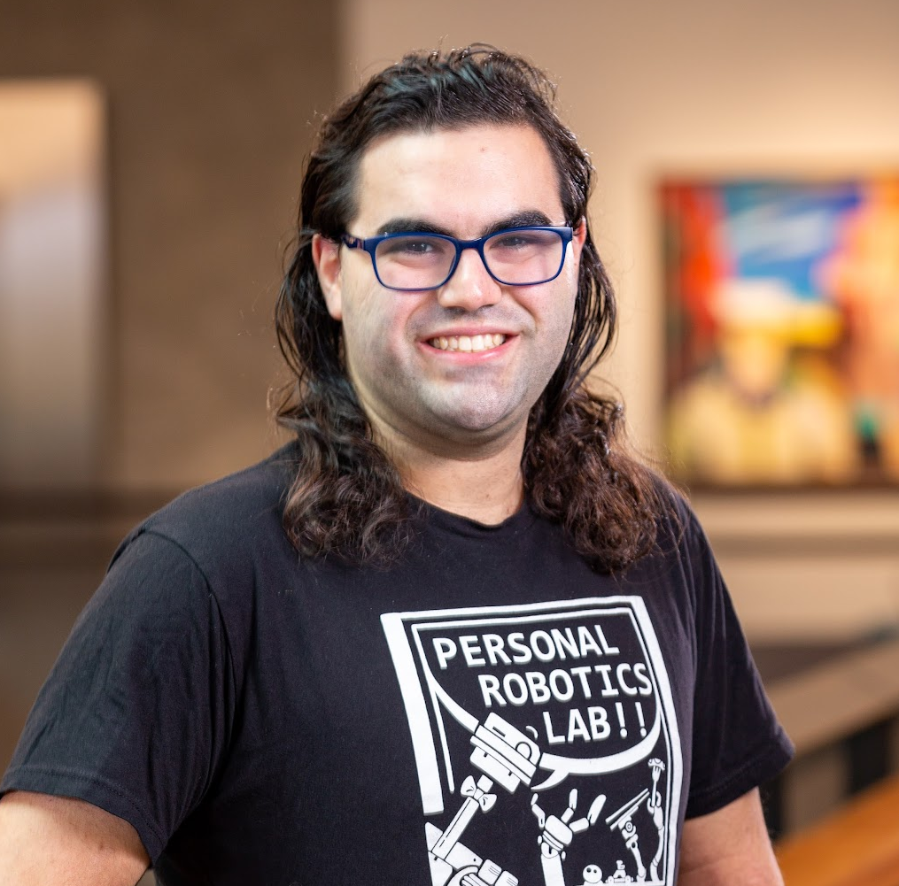

<!-- Intro -->
<section id="intro" class="wrapper style1 fullscreen">
    

        <h1>Ethan K. Gordon</h1>
        

            

                
                <ul class="icons">
                    <li><a href="{{ site.github_url }}">GitHub</a></li>
                    <li><a href="{{ site.linkedin_url }}">LinkedIn</a></li>
                    <li><a href="{{ site.bsky_url }}">Bluesky</a></li>
                </ul>
                <ul class="actions vertical">
                    <li><a target="_blank" href="https://drive.google.com/file/d/1AQ2LirSUaPQXDztQzP9NqYpJgjBNF_Y2/view?usp=drive_link" class="button icon fit"> CV</a></li>
                    <li><a href="{{ site.scholar_url }}" class="button icon fit"> Scholar</a></li>
                    <li class="tooltip"><a class="button icon fit" onclick="copyEmail()" onmouseout="resetTooltip()">Copy ethan@ethan<b>harvester obfuscation</b>kgordon.com</a></li>
                    <!-- See https://spencermortensen.com/articles/email-obfuscation/#text-display -->
                </ul>
                <!-- Copy Email Script -->
                
            

            

                

                    I am a Postdoctoral Researcher at the
                    <a href="https://www.grasp.upenn.edu/">University of Pennsylvania (GRASP)</a> advised by <a href="https://dair.seas.upenn.edu/posa/">Michael Posa</a> in the DAIR Lab. With funding from the <a href="https://theaiinstitute.com/">Boston Dynamic AI Institute</a>, I am developing active exploration and online learning algorithms for dexterous manipulation with sparse (e.g. tactile) perception.
                

                

                    In 2023, I completed my PhD in the <a href="https://personalrobotics.cs.washington.edu/">Personal Robotics Lab</a> at the University of Washington, where I was advised by <a href="https://goodrobot.ai/">Siddhartha Srinivasa</a> and collaborated with <a href="https://sites.google.com/site/tapomayukh">Tapomayukh Bhattacharjee</a>. My dissertation involved developing online learning algorithms for tractably adaptable food manipulation with the primary application of <a href="https://robotfeeding.io">robot-assisted feeding for those with mobility impairments</a>. Previously, I received my BSE from Princeton University, where I studied neuromorphic silicon photonics with <a href="https://prucnal.princeton.edu/">Paul Prucnal</a>.
                

                

                    I have also had the pleasure to work on <a href="https://www.meta.com/blog/quest/half-dome-updates-frl-explores-more-comfortable-compact-vr-prototypes-for-work/">varifocal VR headsets</a> at Meta (Oculus VR). In my spare time, I enjoy skiing, singing <a href="https://www.rittenhousesound.org/">a cappella</a>, and D&amp;D.
                

            

        

    

</section>

<!-- One -->
<section id="news" class="wrapper style2 spotlights">
    

        <h2>What's "New"?</h2>
        

            <table>
                <tbody>
                    <tr>
                        <th>Oct 2025</th>
                        <td>Rising Star at the <a href="https://nerc2025.cis.cornell.edu/">Northeast Robotics Colloquium (NERC)</a></td>
                    </tr>
                    <tr>
                        <th>Jul 2025</th>
                        <td>On parental leave to welcome <a href="images/lydian_web_public.jpg">Lydian</a> to the world!</td>
                    </tr>
                    <tr>
                        <th>Jun 2025</th>
                        <td>The <a href="https://hrcm-workshop.github.io/">Workshop on Human-Robot Contact and Manipulation (HRCM)</a> at RSS 2025 was a succcess!</td>
                    </tr>
                    <tr>
                        <th>Mar 2025</th>
                        <td>Our <a href="/pubs/2025_03_hri.html">in-home feeding system paper</a> was nominated for Best Systems Paper at HRI 2025!</td>
                    </tr>
                    <tr>
                        <th>Apr 2024</th>
                        <td>Started at Michael Posa's <a href="https://dair.seas.upenn.edu/">DAIR Lab</a> at UPenn</td>
                    </tr>
                    <tr>
                        <th>Apr 2024</th>
                        <td>Selected for the <a href="https://www.washington.edu/husky100/year/2024/#name=ethan-gordon">2024 Husky 100!</a></td>
                    </tr>
                    <tr>
                        <th>Mar 2024</th>
                        <td><a href="https://programs.sigchi.org/hri/2024/awards/best-demos">Best Demonstration Award</a> at HRI 2024, Boulder, CO </td>
                    </tr>
                    <tr>
                        <th>Mar 2024</th>
                        <td>Running the <a href="https://hripioneers.org/archives/hri24/">HRI Pioneers Workshop</a> at HRI 2024, Boulder, CO </td>
                    </tr>
                    <tr>
                        <th>Dec 2023</th>
                        <td>Defended my dissertation and received my PhD from UW!</td>
                    </tr>
                    <tr>
                        <th>Nov 2023</th>
                        <td>Presented at CoRL 2023, Atlanta, GA</td>
                    </tr>
                    <tr>
                        <th>Nov 2023</th>
                        <td>The Assistive Dexterous Arm (ADA) Feeding Demo is awarded the People's Choice Prize at UW Demo Day</td>
                    </tr>
                    <!--
                    <tr>
                        <th>Jun 2023</th>
                        <td>Awarded Best Poster at the <a href="https://sites.google.com/unisi.it/workshop-manipulation">Workshop on Assistive Manipulation</a> at ICRA 2023, London, UK</td>
                    </tr>
                    <tr>
                        <th>Mar 2023</th>
                        <td>Awarded Best Design Paper at <a href="https://humanrobotinteraction.org/2023/awards/">HRI 2023</a>, Stockholm, SE</td>
                    </tr>
                    <tr>
                        <th>Jan 2023</th>
                        <td>Accepted as an <a href="https://hripioneers.org/archives/hri23/participants/">HRI 2023 Pioneer</a>, Stockholm, SE</td>
                    </tr>
                    -->
                </tbody>
            </table>
        

    

</section>

<!-- Two -->
<section id="pubs" class="wrapper style3">
    

        <h2>Research</h2>
        
Robotic manipulation can advance the human condition in so many ways: from physical assistance for those with mobility impairments to construction tasks in dangerous environments to the fine grain motions of surgery. All of these tasks require the robot to adapt to previously-unseen and uncertain environments. Just as humans continuously build and refine our understanding of this world over time, a robot should be able to treat every second of deployment as a learning opportunity. My goal is to understand how to capitalize on these opportunities to make contact-rich dexterous manipulation as intuitive to robots as it is to humans.

        <h3>Select Publications</h3>
        

        
            

            

                
            

            

                <h3><a href="{{ pub.url }}">{{ pub.title }}</a></h3>
                

                    {{ pub.authors }} 
                    <i>{{ pub.conf }} {{ pub.year }}, {{ pub.loc }}</i>
                     <b>{{ pub.award }}</b> 
                

                <ul class="actions">
                    <li><a href="{{ pub.pdf }}" class="button icon"> Paper</a></li>
                    <li><a href="{{ pub.video }}" class="button icon"> Video</a></li>
                    <li><a href="{{ pub.web }}" class="button icon"> Website</a></li>
                </ul>
            

            

            

        
    

</section>
